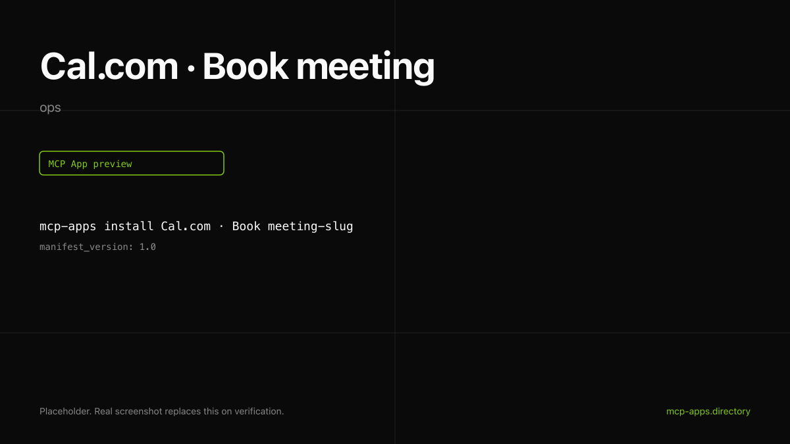

# Cal.com · Book meeting

Book a Cal.com meeting from inside the chat. The widget shows the booking title, start time in the attendee's timezone, and a link to the booking page.



## What it does

- Books any Cal.com event type by `event_type_id`.
- Accepts attendee email, optional name, and timezone.
- Renders the confirmation card with timezone-aware formatting.

## Install

```bash
mcp-apps install calcom-book --host both
```

## Auth

Uses a Cal.com API key. Generate one at [app.cal.com/settings/developer/api-keys](https://app.cal.com/settings/developer/api-keys). The host stores it in its connector secret store, encrypted at rest.

## Hosts verified

- **ChatGPT** ([chatgpt.png](chatgpt.png)).
- **Claude** ([claude.png](claude.png)).

## Source

[calcom/cal-mcp](https://github.com/calcom/cal-mcp).

---

Curated by [Authsome](https://authsome.ai) · agent identity for third-party APIs.
