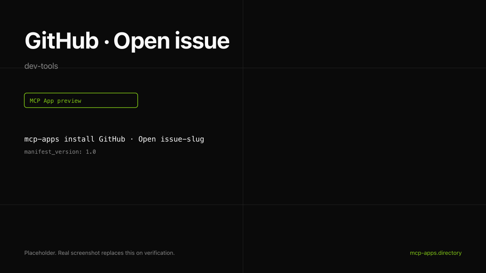

# GitHub · Open issue

Open a GitHub issue from inside the chat. The widget returns a card showing the issue number, repo, title, and a link back to github.com.



## What it does

- Opens an issue in any repo you have `issues:write` on.
- Supports labels and assignees.
- Returns the issue number, url, state, and repo full name.

## Install

```bash
mcp-apps install github-open-issue --host both
```

## Auth

OAuth via GitHub's hosted MCP. The first call links your account through the host's connector UI. No personal access tokens to manage.

## Hosts verified

- **ChatGPT** ([chatgpt.png](chatgpt.png)).
- **Claude** ([claude.png](claude.png)).

## Source

[github/github-mcp-server](https://github.com/github/github-mcp-server) plus the hosted endpoint at `api.githubcopilot.com/mcp`.

---

Curated by [Authsome](https://authsome.dev) · agent identity for third-party APIs.
