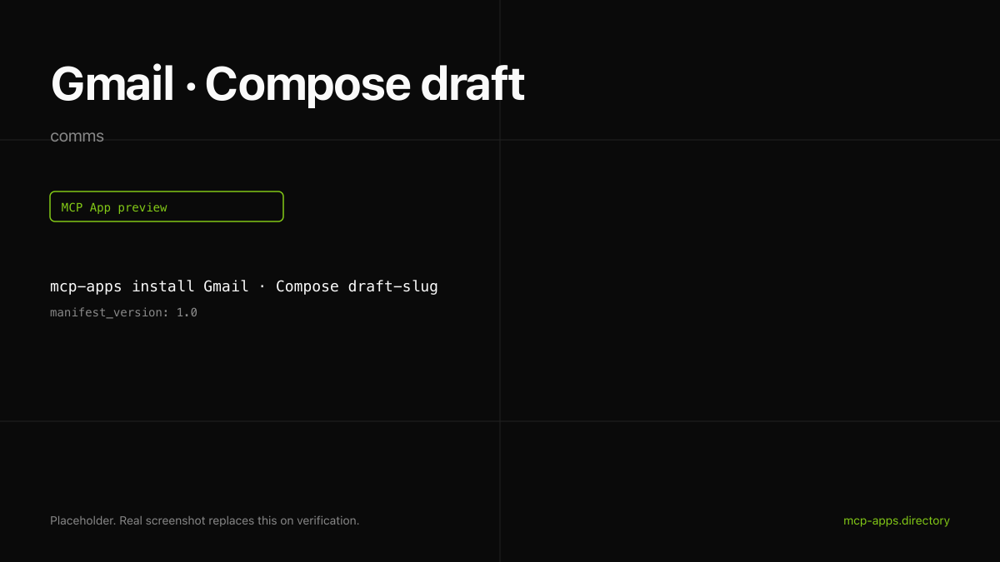

# Gmail · Compose draft

Compose a Gmail draft from inside the chat. The widget renders a Gmail-styled preview card with the recipients, subject, and snippet. **Does not send.**



## What it does

- Creates a draft (never sends) in the user's Gmail account.
- Supports `to`, `cc`, plain text or HTML body.
- Returns the draft id and a deep link to mail.google.com.

## Install

```bash
mcp-apps install gmail-compose --host both
```

## Auth

Google OAuth with the `gmail.compose` scope. For BYO Google Cloud projects, see [authsome.md](authsome.md) for the recipe that keeps client secrets out of the host config.

## Hosts verified

- **ChatGPT** ([chatgpt.png](chatgpt.png)).
- **Claude** ([claude.png](claude.png)).

## Source

Google ships the official Gmail MCP server at [gmailmcp.googleapis.com/mcp/v1](https://developers.google.com/workspace/gmail/api/guides/configure-mcp-server) (GA at Cloud Next '26). For a fully self-hosted option, see the [authsome.md](authsome.md) recipe.

---

Curated by [Authsome](https://authsome.dev) · agent identity for third-party APIs.
