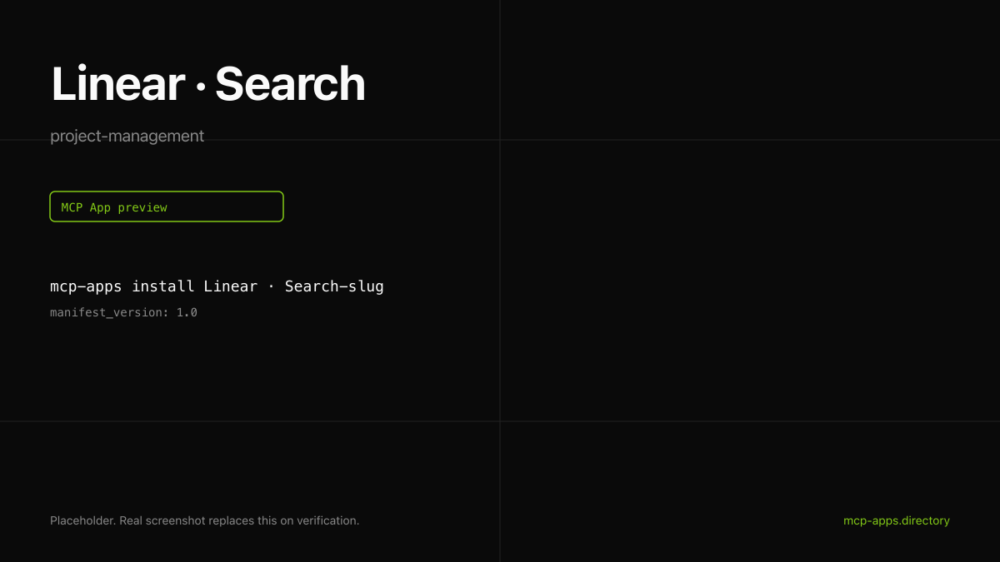

# Linear · Search

Search Linear issues from inside ChatGPT or Claude. Results render as a clickable list inside the chat surface; clicking opens the issue in the Linear web app.



## What it does

- Full-text search across every Linear issue you can see.
- Returns up to 25 matches with team, state, priority, and assignee.
- Click a row to open the issue in linear.app.

## Install

```bash
mcp-apps install linear-search --host both
```

Or pipe the bundled installer:

```bash
curl -fsSL https://raw.githubusercontent.com/agentrhq/mcp-apps.directory/main/entries/linear-search/install.sh | bash
```

## Auth

Uses Linear's remote MCP OAuth flow. First call triggers the host's connector linking UI. See [authsome.md](authsome.md) for the credential-injection recipe if you do not want to ship Linear OAuth credentials through the host.

## Hosts verified

- **ChatGPT** rendered the widget on the first call. See [chatgpt.png](chatgpt.png).
- **Claude** rendered the same widget with `prefersBorder: true`. See [claude.png](claude.png).

## Source

Linear ships the remote MCP server at `https://mcp.linear.app/sse`. This entry wraps that server with the official Apps SDK widget bundle.

---

Curated by [Authsome](https://authsome.dev) · agent identity for third-party APIs.
