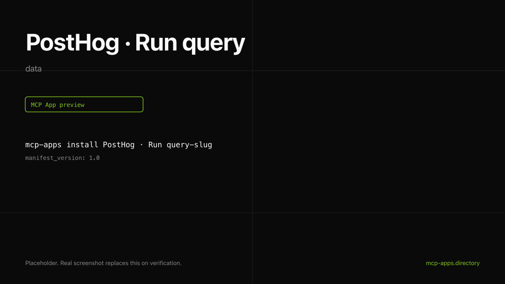

# PostHog · Run query

Run a HogQL query against a PostHog project and render the result as a table inside the chat. Read-only.



## What it does

- Executes any HogQL query the user has access to.
- Returns up to 200 rows with columns and timing.
- Renders as a compact monospaced table.

## Install

```bash
mcp-apps install posthog-query --host both
```

## Auth

Personal API key from [app.posthog.com/settings/user-api-keys](https://app.posthog.com/settings/user-api-keys). Tool is marked `readOnlyHint: true` so the host can route it without elevated approval flows.

## Hosts verified

- **ChatGPT** ([chatgpt.png](chatgpt.png)).
- **Claude** ([claude.png](claude.png)).

## Source

[posthog/mcp](https://github.com/posthog/mcp).

---

Curated by [Authsome](https://authsome.ai) · agent identity for third-party APIs.
