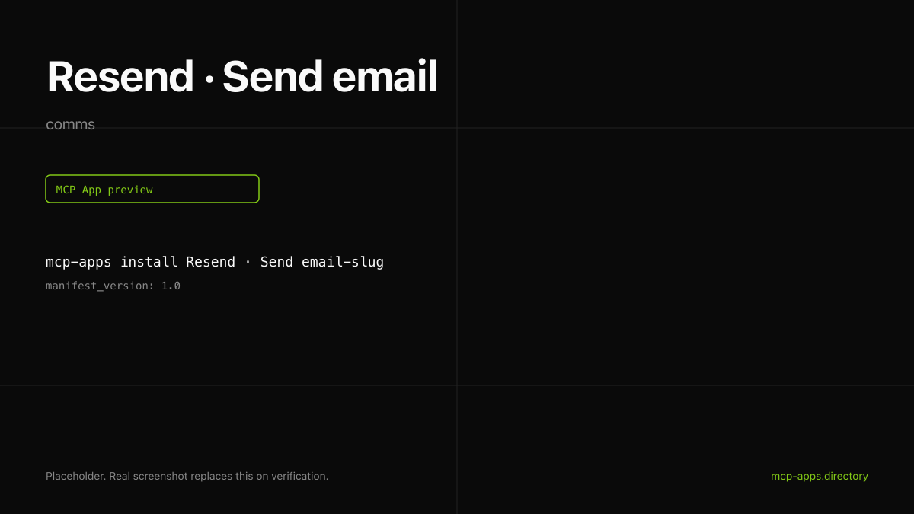

# Resend · Send email

Send a transactional email via Resend from inside the chat. Renders a confirmation card with the email id and a link to delivery logs.

> **Self-hosted only.** Resend does not run a hosted remote MCP endpoint today. You must run `npx resend-mcp` locally first; the manifest's `server.url` points at `http://127.0.0.1:3000/mcp`. See [resend/resend-mcp](https://github.com/resend/resend-mcp) for the server.



## What it does

- Sends a real email via Resend (plain text or HTML).
- Returns the email id and optional `delivery_url`.
- Renders a confirmation card.

## Install

```bash
mcp-apps install resend-send --host both
```

## Auth

Resend API key. **Use a domain-scoped sending key, not your account-level key.** See [authsome.md](authsome.md) for the safe injection recipe and a CLI-only flow that never paste-loads the key into the host.

## Hosts verified

- **ChatGPT** ([chatgpt.png](chatgpt.png)).
- **Claude** ([claude.png](claude.png)).

## Source

[resend/resend-mcp](https://github.com/resend/resend-mcp).

---

Curated by [Authsome](https://authsome.ai) · agent identity for third-party APIs.
