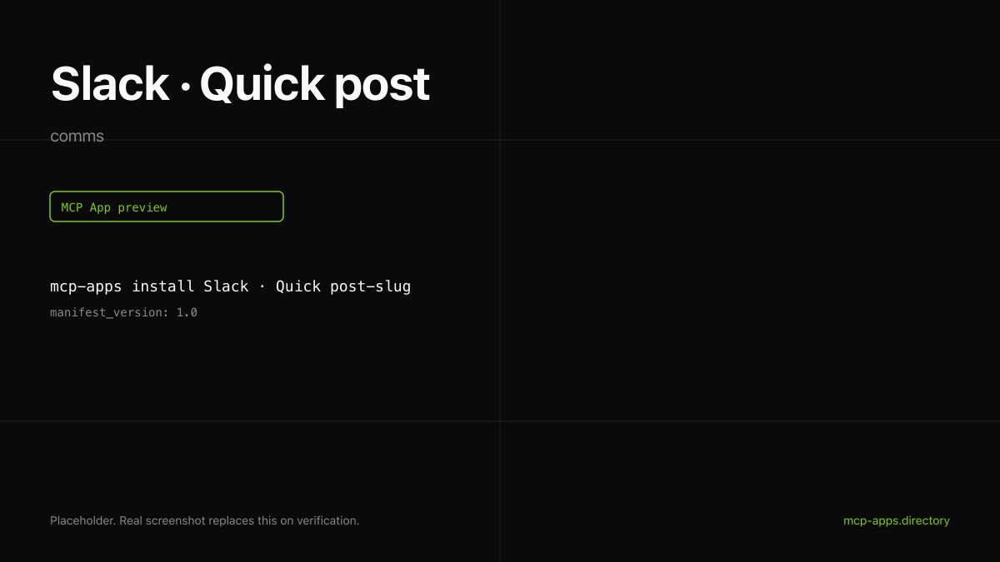

# Slack · Quick post

Post a Slack message from the chat. The widget renders a preview that matches Slack's message styling, including channel name and a "open" link.



## What it does

- Posts a message to any channel you can `chat:write` to.
- Supports thread replies via `thread_ts`.
- Returns the message timestamp, permalink, and channel.

## Install

```bash
mcp-apps install slack-quick-post --host both
```

## Auth

OAuth via Slack with the `chat:write` scope. For workspaces where the host cannot complete OAuth, use [authsome.md](authsome.md) to inject a bot token instead.

## Hosts verified

- **ChatGPT** ([chatgpt.png](chatgpt.png)).
- **Claude** ([claude.png](claude.png)) with live preview before send.

## Source

[Slack's MCP server](https://docs.slack.dev/ai/slack-mcp-server).

---

Curated by [Authsome](https://authsome.dev) · agent identity for third-party APIs.
