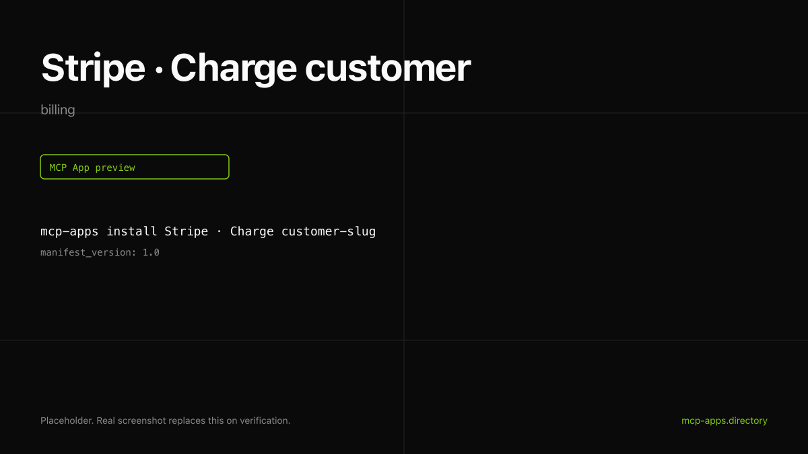

# Stripe · Charge customer

Run a one-time charge against a saved Stripe customer from the chat. The widget renders the receipt with amount, status, and a link to the Stripe receipt page.



## What it does

- Charges a `cus_*` Stripe customer for a given amount and currency.
- Returns the charge id, status, and `receipt_url`.
- Renders as a receipt card matching Stripe's UI tokens.

## Install

```bash
mcp-apps install stripe-charge --host both
```

## Auth

Uses a Stripe **restricted key** with the `charges:write` permission. **Do not paste your `sk_live_*` key into the host.** See [authsome.md](authsome.md) for the safe credential-injection recipe.

## Hosts verified

- **ChatGPT** ([chatgpt.png](chatgpt.png)).
- **Claude** ([claude.png](claude.png)).

## Source

Stripe ships an official MCP at [mcp.stripe.com](https://docs.stripe.com/mcp). This entry wraps the `charges.create` tool.

---

Curated by [Authsome](https://authsome.dev) · agent identity for third-party APIs.
