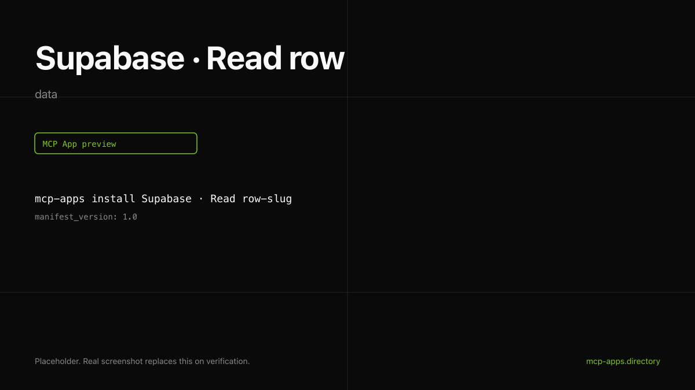

# Supabase · Read row

Read a single row from any Supabase table by primary key. Renders the field values as a compact monospaced card.



## What it does

- Reads one row from any Supabase project the API key has access to.
- Supports custom `select` for column projection.
- Read-only and idempotent.

## Install

```bash
mcp-apps install supabase-row --host both
```

## Auth

Uses a Supabase **service role key**. **This key has full database access.** Never paste it into the host config directly. See [authsome.md](authsome.md) for the recipe that scopes the key to a single table and injects it at request time.

## Hosts verified

- **ChatGPT** ([chatgpt.png](chatgpt.png)).
- **Claude** ([claude.png](claude.png)).

## Source

[supabase-community/supabase-mcp](https://github.com/supabase-community/supabase-mcp) plus the hosted endpoint at `mcp.supabase.com`.

---

Curated by [Authsome](https://authsome.ai) · agent identity for third-party APIs.
