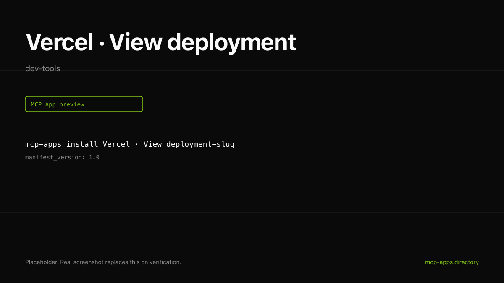

# Vercel · View deployment

Look up a Vercel deployment by id and render a status card. Shows project, state, branch, commit, and the live URL.



## What it does

- Reads any `dpl_*` deployment the user has access to.
- Renders state as a colored chip matching Vercel's UI (READY blue, BUILDING amber, ERROR red).
- Read-only; safe to call without confirmation.

## Install

```bash
mcp-apps install vercel-deployment --host both
```

## Auth

Vercel OAuth with `read:deployments`. First call links via the host's connector UI.

## Hosts verified

- **ChatGPT** ([chatgpt.png](chatgpt.png)).
- **Claude** ([claude.png](claude.png)).

## Source

[Vercel MCP docs](https://vercel.com/docs/mcp).

---

Curated by [Authsome](https://authsome.ai) · agent identity for third-party APIs.
